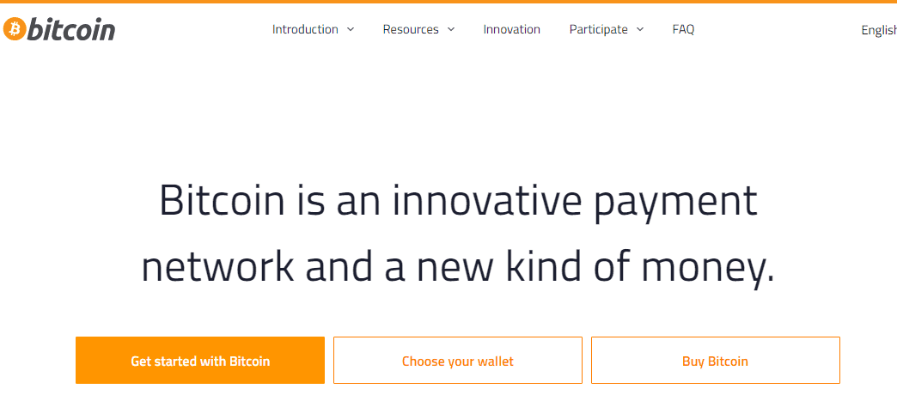

# Bitcoin: A Peer-to-Peer Electronic Cash System

比特币是以非常低的成本进行交易的最简单方式。

在移动设备上使用比特币时，您可以通过简单的两步扫描和支付进行支付。无需注册、刷卡、输入 PIN 码或签署任何内容。您只需在您的比特币钱包应用程序中显示二维码，让对方扫描您的手机，或将两部手机触摸在一起（使用 NFC 无线电技术）即可接收比特币付款。

比特币交易由数学和能源保障。[加密签名](https://en.bitcoin.it/wiki/Elliptic_Curve_Digital_Signature_Algorithm)可以防止其他人花你的钱。[工作量证明 (PoW)](https://en.bitcoin.it/wiki/Proof_of_work)消耗的能量可以防止其他人撤消、重新安排或丢失您的交易。只要你采取必要的措施来[保护你的钱包](https://bitcoin.org/en/secure-your-wallet)，比特币就可以让你控制你的钱，并为多种类型的欺诈提供强大的保护。

与电子邮件类似，您无需要求您发送比特币的收件人使用相同的软件、钱包或服务提供商。您只需要他们的比特币地址，然后您就可以随时与他们进行交易。比特币网络一直在运行，从不睡觉，即使在周末和节假日也是如此。

