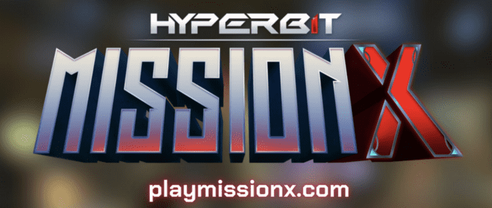
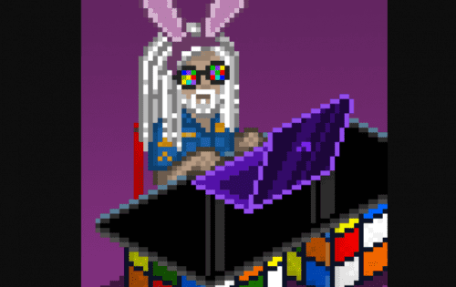

# BitcoinBillionaires

比特币亿万富翁是 13,337 个独特的像素艺术 NFT 的集合，其灵感来自下载量超过 1000 万的热门手机游戏。 亿万富翁由 6 个物种的 200 多个特征组成，他们居住在一个适合于一些非常奇怪的世界建设的宇宙中。 毕竟，这是“你的亿万富翁。你的故事”！

发布的好处包括随机空投 BAKC、Bored Ape 和 Crypto Punk NFT，总价值为 50 万美元。 稍后发布的路线图包括游戏持有者可以玩来赚取/赢取 ETH、NFT 奖励等。 该团队由经验丰富的游戏开发者和长期的加密爱好者组成，所以期待亿万富翁们会随着时间的推移变得更加有趣！

