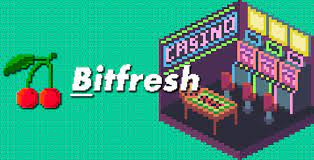

# Bitfresh

Bitfresh 是一个安全透明的基于区块链的 iGaming 平台，具有社区至上、DeFi 功能和独特的游戏化功能。 想想您对区块链赌场的所有期望（非托管投注、采矿、分红等），加上实际拥有影响项目路线图的发言权的好处，听起来不错吧？
< p>Bitfresh 不断开发以提供令人兴奋的新功能，同时考虑到社区反馈，并随着时间的推移为 Bitfresh 代币 (BFT) 提供更多用例。

BFT 代币是基于 BEP20 的实用代币，具有 1,000,000,000 最大供应量。 BFT 是平台内的一种交换手段，具有多种应用：

● Staking。 通过质押用户可以获得平台利润（红利） ● 用于投注和支付的游戏内货币 ● 参与Bitfresh iGaming 生态系统的奖励 ● 现金返还。 ● 退还玩家净损失的一定百分比等。

