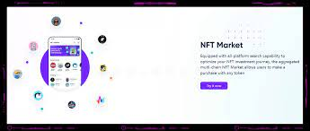
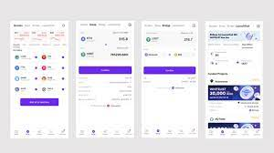

# BitKeep NFT Market

<strong>聚合</strong> NFT 市场，BitKeep NFT 市场支持在不锁定相关 NFT 的情况下上架第三方挂单。 目前，ETH、BSC、HECO 和 Polygon 上的 NFT 均受支持。 无需插件； BitKeep NFT Market 是完成所有交易的一站式商店。

BitKeep Global Inc. 于 2018 年 5 月在新加坡成立，目前为全球近 <strong>600 万</strong>用户提供服务，覆盖北美、欧洲和亚洲的近 <strong>168 个</strong>国家。 我们专注于新兴市场。 截至目前，BitKeep已在东南亚、南美和非洲建立了<strong>超过15个</strong>本地团队，走上高速增长的轨道。

BitKeep最新一轮融资由蜻蜓领投，高融资本、远见创投、诚诚资本、币信资本、SevenX Ventures等跟投。

