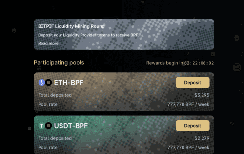
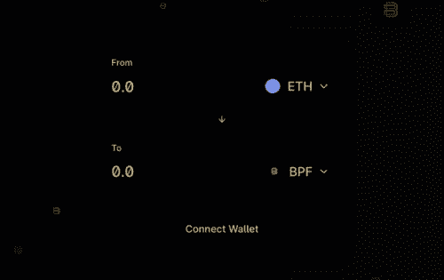

# BITPIF

BITPIF是去中心化金融（Open Finance），是指建立在以太坊之上的加密（数字）资产和以太坊智能合约、协议和去中心化应用程序（dApp）。 BITPIF 生态系统由 $BPF 代币控制。

**这个怎么运作：**

质押并开始赚取 BPF 流动性奖励：

1. 在BITPIF上交换 BPF
2. 您必须首先向资金池提供流动性
3. 为了提供流动性，您将收到 UNI-V2 代币，它代表您向池中贡献的代币。仅仅提供流动性不会为您赢得 BPF 奖励，您必须完成下一步才能获得 BPF 奖励。
4. 使用您地址中上一步中的 UNI-V2 代币访问BPF，并输入您想要质押的 UNI-V2 代币数量并获得 BPF 奖励。

**分配规则：**

1. BPF 将根据每个地址在奖励合约中质押的 UNI-V2 总量的百分比进行分配。

2. 支付的 BPF 奖励金额与每个地址的余额和质押时间成正比。

3. 付款将自动进行

4. 需要从BPF手动领取付款

