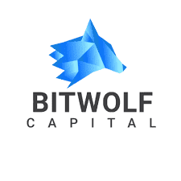
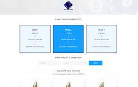

# bitwolves

这些智能合约是金融公司的一个子集，提供信号和区块链中的其他服务，包括 Metaverse、WebTree 和等等你可以使用这个智能合约和公司的其他部分进行登录，关于你在这家公司的投资，我们必须说你从 100% 投资的部分资金，50% 将留在前几个月的月利润池，剩下的 5% 的其他 50% 将归公司作为费用和&nbsp;另外 45% 将成为加密货币领域的明星交易。

<strong>关于交易者</strong>

现在已经 2 年我们活跃在加密货币和加密货币领域。区块链，我们的主要公司有不同的活动，这个智能合约就是其中之一。

<strong>第一种方式：</strong> 6 个月合约的月利润为 2% 您将 &nbsp;存款 &amp;退出 Tron。

<strong>第二种方式：&nbsp;</strong>1年合约月利润为4%。

<strong>第三种方式：&nbsp;</strong>2 年合约的月利润为 6%。

<strong>一级：</strong>您是直接介绍，您将获得 5% 的利润。

<strong>第二级：</strong>你介绍的人都将获得 3% 的利润。

<strong>第三级：</strong>在介绍人结束时，您将获得 2% 的利润。

