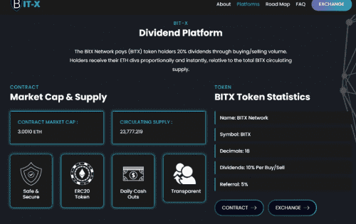
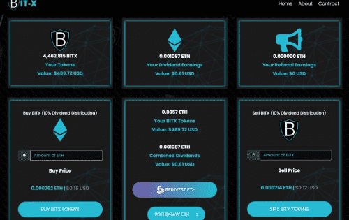

# BITX Network

BITX 交易所是一个基于交易量的分红平台，通过买卖交易量向BITX 代币持有者支付 10% 的分红。 相对于BITX流通的总供应量，持有者按比例立即收到他们的ETH div。

# 基本概述

- **BitX Gold (BXTG)**：是一个完全符合 ERC20 和 ERC223 的代币，可作为BITX 代币的扩展。
- 当您购买 BXTG 时，BXTG 合约会购买 INTX 并为您提供完全相同数量的 BXTG。
- BXTG 与BITX“绑定”，因此**1BXTG 将始终 = 1BITX**。

（***重要提示：这意味着出售BITX以购买BXTG没有任何好处，但您可能想用BITX股息购买BXTG！\***）

- 当BITX产生分红时，BXTG持有者也会收到同样的分红。
- 实际上，拥有 BXTG 与拥有 INTX 是一样的！

# BXTG 是如何工作的？

BXTG 的规则与 INTX 非常相似：

- 10% 的购买费用
- 10% 的销售费用
- 费用以以太币的形式分配给代币持有者。
- 一旦账户余额达到 1 个或更多 BXTG，就会启用 BXTG 主节点。这将使 5% 的买入费直接转给推荐人，就像它对BITX 所做的那样。
- 代币转账手续费 0%（*注*：BITX 代币转账手续费为 10%）

