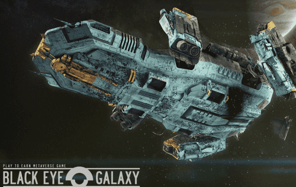

# Black Eye Galaxy

Black Eye Galaxy [BYG] 是一款虚拟世界游戏，旨在为其成员提供令人兴奋的太空探索体验。 BYG 提供了许多可玩的不可替代代币 (NFT) 资产，从行星到宇宙飞船和建筑物——所有这些资产都可交易、可转让并真正归玩家所有。&nbsp;

游戏主要在币安智能链上运行，但我们计划将所有主流的 Layer-1 Blochckains 集成到我们的游戏中，创造真正的跨链元界体验。

## 文明

- 文明将能够进化、开发新技术并探索新太阳系的空间
- 文明将由 DAO 管理
- 他们将从会员的交易中征税以形成预算。原始 BYG 代币中还将有一个小空间联合税来支付项目维护费用

## 有人居住的行星 跨链

- 文明的心脏是一个有人居住的星球

- 有人居住星球上的土地将作为 NFT 出售，用于建造城市、建筑物并发展人口和技术

- 我们将介绍星团——拥有许多恒星的大空间区域

- 每个星团将部署在不同的第一层区块链上（从币安链开始）

- 3+星系统的拥有者可以创建星空联盟

- 每个星空联盟都会发行一张 NFT 会员卡

  
