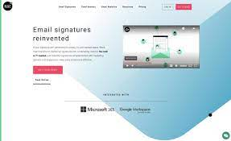

# Black Pearl/Meda/Daily ROI

黑珍珠是开放社区平台。 在这里，您可以结交朋友、互相聊天、创建群组并与您所爱的人闲逛。 我们在由智能合约支持的 Tron Blokchain 上创建了这个平台，任何人都无法随时修改、删除或关闭它，即黑珍珠（Meda）将永远存在。 我们的合同已经过验证。 当人们购买时，我们的 Meda 代币价值略高，而当他们出售时，价值略低 所有提到的费用都归 MEDA 持有人所有。 我们没有任何开发人员费用或营销费用。 在每日投资回报率中，您每天将获得 4% 的收益，直到合约有 Tron 余额。

## Tron

Tron是一個基於區塊鏈的操作系統，正在使用分佈式存儲技術構建一個免費的，全球性的內容娛樂結構-允許輕鬆，廉價地共享圖像和視頻等數字內容，以"分散網絡"。

它由新加坡一家名為Tron Foundation的組織於2017年創立，由首席執行官賈斯汀·孫（Justin Sun）運營，並擁有一支專門的內部開發團隊來推進該項目。

通過利用區塊鍊和點對點技術的獨特功能，Tron致力於消除娛樂中間商（例如Netflix或Amazon之類的公司），並允許內容創建者直接接觸消費者。結果將為所有相關人員帶來更便宜的成本，並為內容創建者帶來更多控制權。

消費者可以使用Tron加密貨幣來支付他們想要在網絡上訪問的內容的費用。

