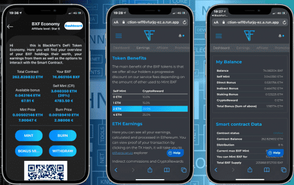

# BlackFort Token

使用 <strong>BlackFort 钱包</strong>，您可以<strong>存储</strong>、<strong>管理</strong>、<strong>购买</strong>、<strong>更改</strong>并<strong>提取</strong>您的加密货币。

<strong>BXF 代币的使用：</strong>

无论您购买、出售或兑换货币，您都可以获得

<strong>高达 25% </strong>产生的费用作为在 ETH（以太坊）中收到的加密奖励。

•<strong>BXF</strong> 铸币值介于 &nbsp;&nbsp;&nbsp;<strong>0</strong>-<strong>1</strong> ETH <strong>&nbsp;&nbsp;</strong> = <strong>10%</strong>

•<strong>BXF</strong> 铸币值介于 &nbsp;&nbsp;&nbsp;<strong>1</strong>-<strong>2</strong> ETH<strong> &nbsp;</strong>= <强>15%</strong>

•<strong>BXF</strong> 铸币值介于 &nbsp;&nbsp;&nbsp;<strong>2</strong>-<strong>4</strong> ETH<strong> &nbsp;</strong>= <强>20%</strong>

•<strong>BXF</strong> 铸币价值在 &nbsp;&nbsp;&nbsp;&nbsp;<strong>4+</strong> ETH<strong> &nbsp;</strong>= <strong>25%</强>

<strong>机会：</strong>

每当<strong>BXF</strong>被铸造、转移或销毁时，8%的当前ETH价值都会流入

<strong>BlackFort Pool</strong>并在智能合约中分配给所有 BXF 持有者。

<strong>用户忠诚度奖励（BXF 持有者）：</strong>

兑换费忠诚奖励：

BlackFort 钱包奖励忠诚的持有者，在全球实时获得高达 25% 的交易所产生费用。 ETH 分配是无摩擦的。

请通过 APP MINT 以获得 CryptoReward 等级

