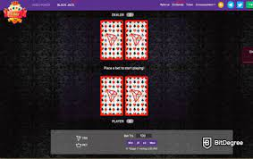

# Blackjack (PKT)

Tron 上的第一个二十一点。 每24小时分红，80%利润分配。

##### 二十一点 (PKT) DAPP 技术分析

**Blackjack (PKT)** dApp 是一种基于**Tron**协议的**赌博**类别的加密资产。现在，根据用户数量，它在一般 dApp 排名中排名**第 3785**位，在**赌博类别中**排名第 1027**位，这让您可以很好地了解**Blackjack (PKT) dApp 在其竞争对手中的表现。

通过分析最近 30 天窗口中的 Blackjack (PKT) dApp 数据，很明显 dApp 的Balance**为**$ **3.4K**，**Volume**稳定**在**$0.00**。**二十一点 (PKT)**在 30 天内产生了**0 笔交易**，**变化率为 0% 。**显然，与之前的 7 天相比，**成交量稳定**了**0% 。**最近 7 天的数据显示，21 点 (PKT)**用户基数**为**0**并且**稳定**了**0%。

我们还建议查看**二十一点 (PKT) 活动概览**和智能合约余额图表，了解这些重要指标如何随时间**波动**和变化。

