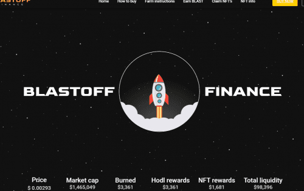
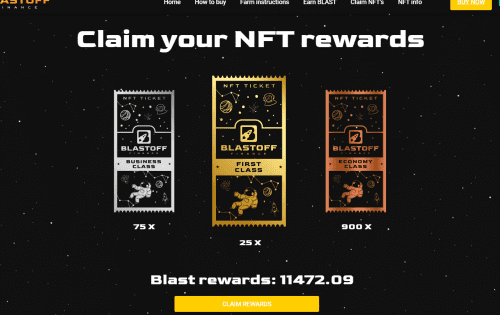

# Blastoff Finance

Blastoff Finance 是市场上最完整的 RFI 静态反射代币，也是同类中第一个向 NFT 所有者分配奖励的代币。&nbsp;

使用 BLAST 代币进行的每笔交易都会产生 10% 的税，分为以下费用：

- 5% 被锁定为 Pancakeswap 的流动性，LP 代币被合约销毁

- 2% 被烧毁&nbsp;

- 2% 用于自动持有奖励

- NFT 所有者可申请 1%

Blastoff Finance DApp 推出了 2 个流动性农场来分配我们的代币。 也有 NFT 农场要求产生奖励的 NFT。 NFT 农场在我们的流动资金池达到阈值时启动。&nbsp;

Blastoff FInance 将继续为我们在 DeFi 世界中的新 DApp 添加新功能。 在为我们的 DApp 创建新产品时，我们专注于易用性、用户安全和降低费用，同时通过创新解决方案提高 APY。

