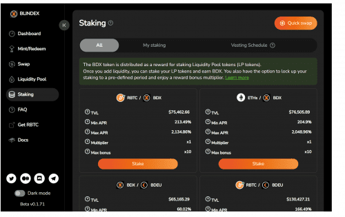
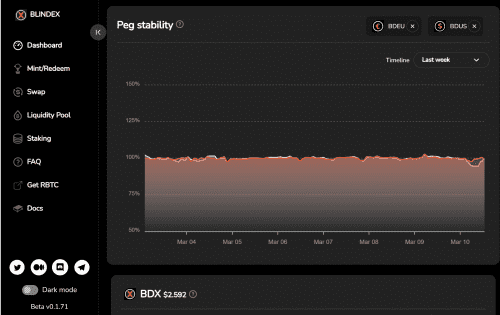

# Blindex

Blindex 是一个<strong>多币种稳定币</strong> DeFi 平台。铸造、交换、投资和赎回任何与外汇挂钩的硬币。所有代币都<strong>部分抵押、算法稳定</strong>和完全<strong>去中心化</strong>。

<u>那么是什么让 Blindex 如此特别？</u>

<strong>多币种</strong> - 货币盲区意味着我们允许地球上的任何人享受财务自由，而不会面临外汇波动的风险。

<strong>真正的去中心化</strong> - 我们正在创造真正去中心化的硬币：从区块链，&nbsp;通过我们的云基础设施 (StackOS)，仅由去中心化资产担保。该项目是作为<u><strong>公平发布</strong></u>推出的，以确保通过 $BDX 持有者实现真正的去中心化。

<strong>不可阻挡</strong> - 我们确保它与集中式马厩断开连接，因此它不会被任何集中式机构列入黑名单、审查或以其他方式影响。

<strong>资本效率 - 不再过度抵押 - </strong>使用我们的稳定机制需要更少的抵押。

<u>愿景</u>

<strong>标记一切！</strong>

价格指数、大宗商品、房地产、股票、债券等。我们真正的去中心化和资本效率系统能够做到。标记一切。

