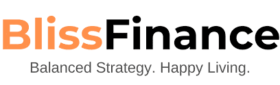
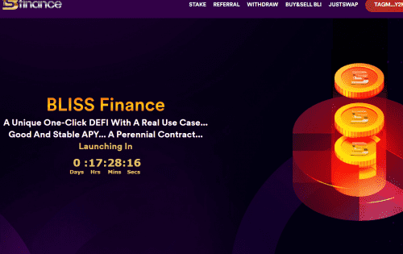

# Bliss.Finance

Bliss.Finance 是一个具有真实用例的 defi。 Bliss 生态系统包括 Bliss Finance、Bliss Casino 和 Bliss Chain。 在 Bliss Finance，您质押 TRX 并赚取 BLI。 在 Bliss Chain，您质押 BLI 并赚取 BLI。 在 Bliss Casino，您可以玩 BLI 代币。 &nbsp;平均而言，您可以获得大约 275 到 300% 的收入。

BlissFinance 就是您的财务授权。它教会客户完全控制他们的钱，这样他们的财务就不会控制他们。结果，他们的客户过着更健康、更幸福的生活，债务减少，信用评分提高，储蓄显着。 

WenFang Bruchett 是该组织的指导力量，也是一位拥有 25 年经验的成功银行专业人士。她是一家全球金融机构的前高管，管理着超过 2 亿美元的资产。她利用这些专业知识帮助将成千上万的消费者和企业家的生活从财务低谷转变为财务偿付能力和财富——甚至帮助早期创业者获得资本。

通过他们的 CASHFormula（Credit、Assets、Savings、Health 的首字母缩写词），Bruchett 女士和 BlissFinance 的使命是使个人和企业能够最大限度地利用他们辛苦赚来的钱，过上更富裕、更健康、更幸福的生活。

