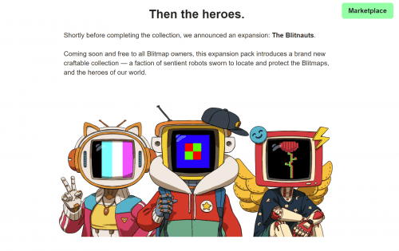
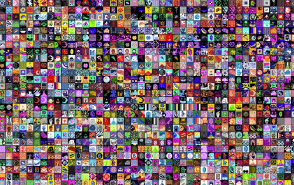

# Blitmap

<strong>一切都始于一些像素艺术。</strong>

我们称它们为 Blitmap。 我们制作了 <strong>100 个原创作品</strong>，社区将它们混合在一起制作了 <strong>1,600 个兄弟姐妹</strong>——将一个原创作品的构图与另一个原创作品的调色板结合在一起的独特作品。

### 然后是英雄。

完成收藏后，我们发布了一个扩展包：[The Blitnauts]。

现在，所有 Blitmap 所有者都可以免费使用此扩展包，该扩展包引入了一个全新的可制作收藏——一个宣誓定位和保护 Blitmap 的有知觉机器人派系，以及我们世界的英雄。

### 现在宇宙。

随着碎片的组合，我们开始进一步扩展世界。Blitnauts的对手是谁？为什么位图很重要？最重要的是：我们将在哪里以及如何看到这些故事展开？

我们的路线图开始制定计划来回答这些问题——沿途有一些惊喜。

### 加入我们！

Blitmap 收藏品经常在二级市场上买卖。

Blitmap 收藏品的拥有者可以获得独特的特权，包括扩展包、帮助引导不断增长的 Blitmap 世界的能力等等。我们才刚刚开始。

