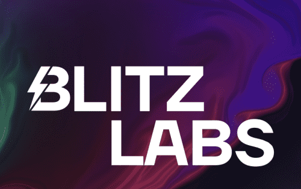

# Blitz Labs

Blitz Labs 是一个 WEB3 集体，致力于开发使基本加密活动（例如但不限于参与预售、交换代币、桥接）尽可能简单且没有不必要复杂性的工具、服务和产品。 Blitz Labs 的最终目标是创建一个一站式商店，用户可以在一个站点上方便地完成所有任务，同时支付尽可能少的费用。 BlitzSale 将是 Blitz Labs 品牌下推出的第一个项目。

$BLITZ 是 Blitz Labs 的产品和服务使用的主要代币。为了通过价格行为、稀缺性和潜在价值来增加代币的价值； Blitz 将是一种固定供应代币，由于以下特点，本质上是通货紧缩的： 购买税：0.3% / 销售税：0.3% 服务费以 $BLITZ 支付 从 Blitz Labs 服务和产品回购导致更高的价格下限和更大的 LP $BLITZ 还将促进 Blitz Labs 治理并允许持有者为网络的发展做出贡献。

