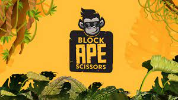
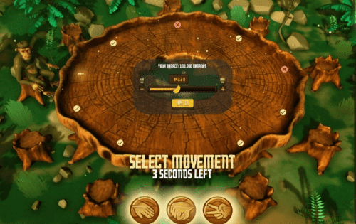

# Block Ape Scissors

Block Ape Scissors - 最具创新性的 Play to Earn 生态系统，建立在币安智能链之上。将游戏、NFT 和 DeFi 结合在一起，形成令人兴奋、多样化和回报丰厚的机会。

BAS 平台将提供许多不同类型的游戏和玩法，为用户赚取结构。包括，第一个“Grind to Earn”系统，消除了区块链游戏的进入障碍。

BAS 生态系统中的每款游戏都将直接与 BAS 代币和 NFT 奖励市场绑定，从而为用户、玩家和投资者提供无限的策略来赚取收益。

BAS 模型将彻底改变区块链游戏空间，并为元界内的 GameFi 交互设定全新标准。

功能性 NFT 是 Grind to Earn 和 Play to Earn 模型的重要组成部分，它们为不同的预算和交互级别提供了多种赚钱方法。 BAS 生态系统的核心组成部分是游戏化 DeFi 生态系统，该生态系统要求准入零门槛，通过众多创新和集成将来自与加密相关的各个角落的个人聚集在一起。

BAS 生态系统中的每款游戏都将直接与 BAS 代币和 NFT 奖励市场绑定，从而为用户、玩家和投资者提供无限的策略来赚取收益。

