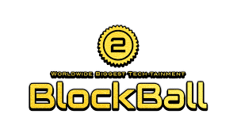
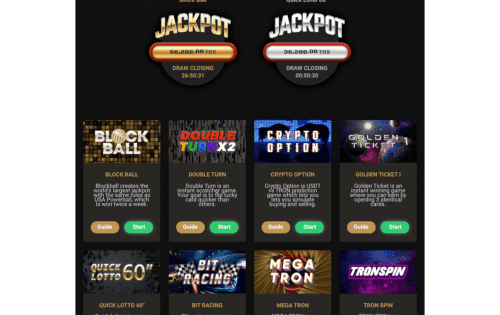

# BLOCKBALL

Blockball平台使用加密货币，可以透明地享受彩票、小游戏、赌博游戏等各种游戏

### BLOCKBALL令牌（BBT）简介

BlockBall在手机游戏中引入了博彩，并与全球赌场集团合作开始了M1 Fighting博彩。 BlockBall还充当集成了移动游戏博彩，经典赌场游戏和体育博彩游戏的大型平台。有影响力的人（Wanghong）与您一起合作宣布BlockBall。平台的每日利润分配基于区块链进行透明管理。 Pos令牌BBT具有更强的爆炸性，因为只发行了数量有限的令牌。

### BBT Tokenomix

BBT令牌的流通有助于平台的发展。 BBT令牌是对平台中未来活动的激励，并鼓励用户了解最新技术和平台的发展，因此BLOCKBALL扩展了服务并增加了令牌持有者的使用经验，并且随着用户的增加，这有望平台将产生更好的解决方案来改善客户体验，然后BBT代币的价值将增加。

✓BBT令牌发行量固定为20亿，并且燃烧令牌持续增长。

