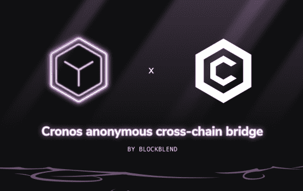
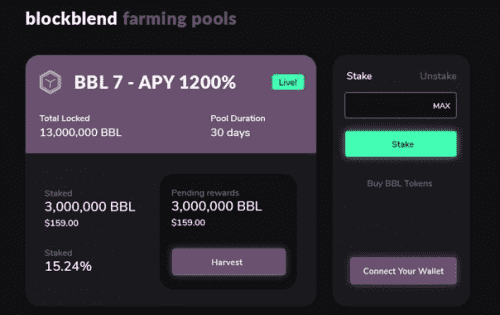

# BlockBlend

BlockBlend 超越常规，提供非 KYC、多交叉区块链交易，每次交易最多可发送 5 个目标钱包。您可以发送 $ETH &amp;接收 $BNB 或任何其他受支持的区块链 &amp;仍然无法追踪。

不再需要通过 CEX 进行。

<strong>匿名交易（混合器）</strong>

个人隐私是当今数字经济中最受关注的问题。 BlockBlend 通过断开连接的链接来提供公共分类账所缺乏的终极隐私。

保持安全。保护你自己。交易与匿名转移您的资金。支持链：ETH、BSC、POLYGON、AVAX &amp; CRO

<strong>农业奖励</strong>

项目将预留一个初始代币池作为奖励。此外，从公用事业使用中收取的 50% 的费用将用于从公开市场回购 BlockBlend 代币以添加到池中。交易产生的 1% 到 2% 的税收也将添加到奖励池中。

<strong>安全</strong>

经审计的合同和PancakeSwap 启动并提供机器人保护

