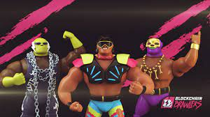

# Blockchain Brawlers

<strong>“从最上面的绳子上看，是尖叫的青蛙！</strong> <strong>他对银狐造成了毁灭性的打击。</strong> <strong>我不知道他会不会挖 自己脱离了这个……”</strong>

认识 Blockchain Brawlers™，这是 Metaverse 历史上最热闹、最有趣的 NFT 系列。 我们谈论的是一个杂乱无章的高跟鞋，其中包括铁杆、鳄鱼 Dundalk 和剑圣（仅举几例），它们将帮助你争取 NFT 霸主地位。

由 WAX Studios 创建的“Founders Edition”传奇 1-of-1 Blockchain Brawlers 的顶级服装和个性并不是使这个限量版系列与众不同的唯一因素。 每个 brawler 在 Blockchain Brawlers 游戏中都扮演着不可或缺的角色，他们在游戏中挣扎并用肘击他们（和您）的名利之路。

区块链永远不会一样，元界中最吵闹的游戏来了！

.jpg)

**BRAWL-O-SEUM**

NFT 允许所有者访问我们所知道的 Blockchain Brawlers 游戏中最强大的工具。

在即将到来的由 Richard Garfield 设计的 Player vs. Player 游戏中，它赋予其所有者制作每个玩家所需的所有资产的独特能力。

## NFT 规格

名称： BRAWL-O-SEUM（白金）

零售价： WAXP 2,500 美元

可用数量：950

输出：每天最多 10 个 NFT 包

名称： BRAWL-O-SEUM（钻石）

零售价： WAXP 5,000 美元

可用数量：150

输出：每天最多 25 个 NFT 包
