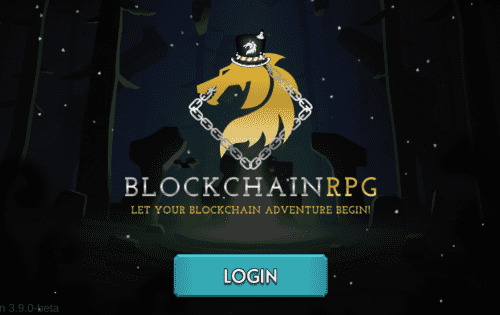
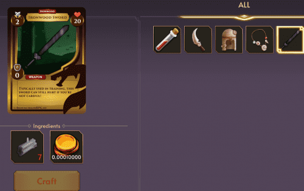

# BlockchainRPG

BlockchainRPG 是遥远的 Aurum 土地上的数字物品元宇宙。 狩猎怪物，获取资源，制作更好的工具，并与他人竞争。 BlockchainRPG 提供有趣的游戏来赚取风格的游戏玩法。 在玩游戏时赚取 GOLD 和稀有 NFT。 与其他玩家交易/购买/出售您的游戏内物品，在您的冒险中互相帮助！ 开始你的区块链冒险吧！

# 使命

BlockchainRPG 是一款基于 WAX 区块链的狩猎角色扮演游戏 (RPG) 去中心化虚拟世界。我们希望冒险者将他们在游戏中的冒险者视为他们自己的延伸。冒险家可以在各种独特的狩猎场狩猎，以我们的元通用货币 - GOLD（代币符号 GOLD）和宝藏（例如制作材料或可装备物品）的形式寻找财富。然后，冒险者可以装备这些物品来增加他们的统计数据并更有效地狩猎，从而提高他们在游戏中前进的能力。这些物品与现实世界的市场相关联，因此对冒险家基地具有价值。游戏机制和代币经济学的创建是为了满足以下目标：

- 不断扩展的游戏，以促进奇妙的体验
- 社区互动，包括但不限于团队合作和友谊赛
- 通过可识别的游戏主题介绍区块链技术

# 支柱

BlockchainRPG 的团队致力于为冒险者提供最高水平的游戏体验，以下是我们希望提供的一些关键点：

### 对所有人公平

- 

  BlockchainRPG 团队致力于为所有级别的冒险家提供公平的游戏玩法，以确保任何冒险家都没有额外的优势。我们正在积极打击所有作弊和黑客行为，包括但不限于机器人、自动化软件、多账户和合同利用。如果您被抓住，您将面临永久禁令和帐户锁定的风险。此外，每个冒险家的所有包和掉落表都是相同的。

### 透明度

- 

  作为区块链的一部分，所有冒险者都将有能力查看正在进行的交易以及谁在进行交易。
