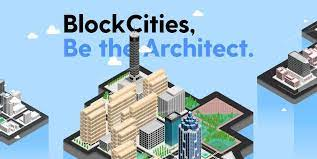
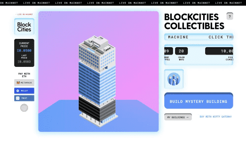

# BlockCities

BlockCities 是一系列建筑收藏品，展示了来自世界各地的标志性建筑。 用户可以建造生成建筑，收集经典，并获得超级稀有的特别版

## 基于里程碑的智能合约

资金根据基于里程碑的智能合约分配进行托管和支付。投资者可以使用我们的资产跟踪器查看项目当前状态，该跟踪器提供资产建设、租赁和管理的实时可视化

## 可持续生活工具包

Blockcities 为可持续生活开发了一个工具包，以比以往更快、更轻松地实现。通过拖放、即插即用的模块化资产，可以在现场交付并为您设置。以及专业管理的农业，提供种子到销售支持。

## 可编程代币化股票中的实物资产

全球投资者可以通过完全合规的代币化所有权获得可持续投资工具。

## 简化交易

我们的平台结合了区块链必须提供的最有用的功能，同时结合了有执照的专业人员、内置的合规性和游戏化的用户体验。 
