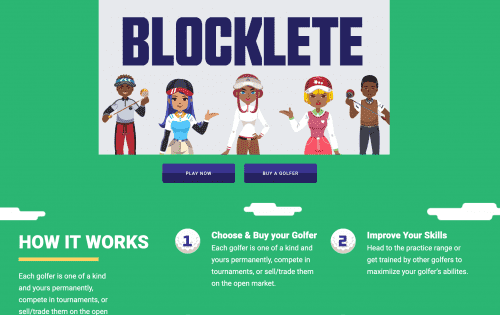
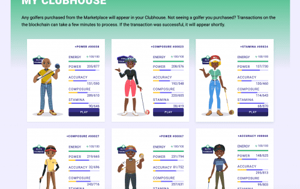

# Blocklete Golf

Blocklete Golf 是 Turner Sports 旗下的 Blocklete games 的旗舰游戏。 这是一种全新的在线体育视频游戏体验，让粉丝们能够收集、训练、交易并与独特的数字运动员竞争，同时他们还能获得现金奖励和吹嘘的权利。

**概述**

Blocklete Games 是一个建立在区块链上的互动游戏系列。我们的愿景是建立一个能够吸引、娱乐并为玩家创造价值的体育虚拟世界。我们在 Blocklete Games 产品组合中的第一个游戏是 Blocklete Golf，这是一款独一无二的高尔夫管理游戏，可通过 NFT 实现数字所有权和效用。

Blocklete Games 旨在提供以下价值主张：“NFT 应通过数字资产所有权使人们受益。”

为此，我们正在构建一个 NFT 项目，其中包括对我们社区的真正实用性。 Blocklete Games 通过允许玩家投入时间和精力来提高每个 Blocklete 的属性级别，从而升级（双关语）核心游戏机制，因此， 价值。

这在业界是革命性的，因为提高 NFT 价值的路径是**由玩家控制的！**

