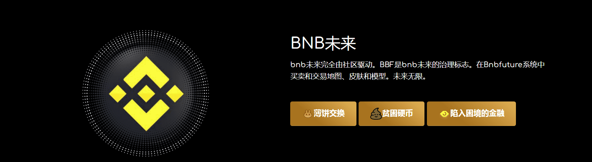
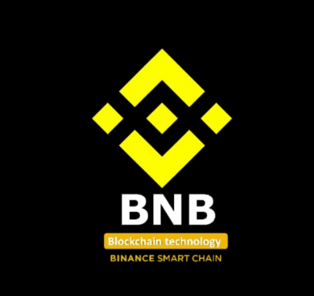

# BNB FUTURE

**BNB未来**

bnb未来完全由社区驱动。BBF是bnb未来的治理标志。在Bnbfuture系统中买卖和交易地图、皮肤和模型。未来无限。

**“去中心化”是什么意思？有什么优势，有什么好处？**

分散式营销是通过自动化合同创建的，为您提供最大的安全性和可持续性。Asmart契约是一种自动执行算法。它存在于Tron区块链中，是顶级加密货币之一。

智能合约和加密货币一样，是去中心化的。它们严格按照底层程序工作，不可能随后改变已定义的执行。包含合同到期的所有逻辑的代码都在上，所有的计算都由世界上数百万台计算机提供。这确保了不存在侵入智能合同并停止项目的风险。

*是交易和信息的不可改变的记录，它受到密码保护，防止随后使用全球成千上万台独立的计算机对其进行任何操作。

