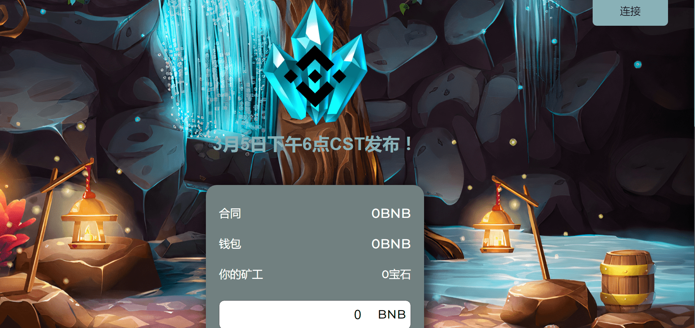

# BNB Gems

什么是&nbsp;BNB 宝石？

Baked Beans 为 Token Miner 元数据带来了有趣的变化。这是一个简单的智能合约，充当 BNB 奖励池，每天返还您池中 BNB 的 15%*，只要奖励池中还有 BNB 即可！用户可以选择吃他们的豆子（获得他们的 BNB 奖励）或重新烘焙他们的豆子（复合获得的 BNB 奖励）。

烤你的豆子，玩得开心，在烘焙时享受你的豆子奖励！

<strong>战略与信息</strong>

BNB Gems 适用于希望获得长期利润和可持续性的用户。不适合那些想要立即获利的人最终会影响他人。

BNB 宝石不要与农场混淆。矿工不是被买来的，而是被雇佣的，因此不能被出售。一旦矿工被雇佣，他们就会无限期地为你工作，以每天 3% 的起始费率为你提供无限量的 BNB。

<strong>其他信息</strong>

保证新投资者获得的收益高于后继投资者，因为他们获得的宝石数量与投资的 BNB 数量相比总是略高。&nbsp;

