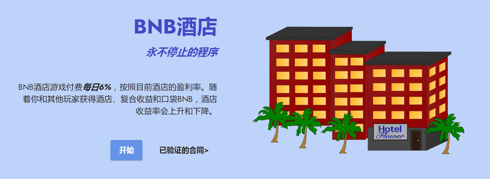
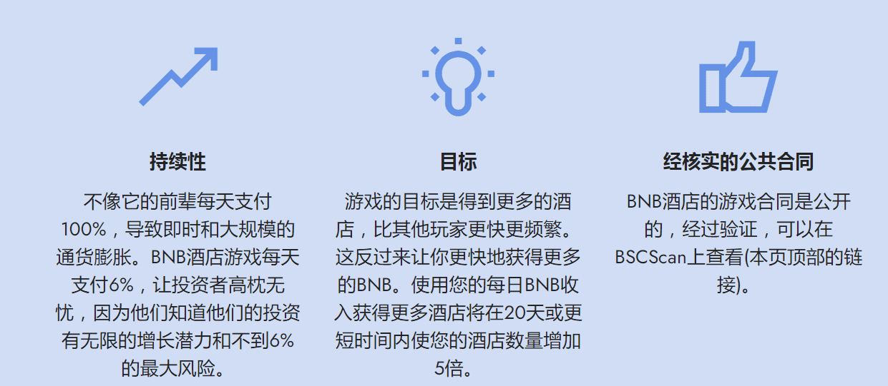

# BNB Hotels

BNBHotels 是一款 DeFi（去中心化金融）闲置游戏，产生源源不断的利润！&nbsp;

BNBHotels 每天支付 6%（年利率为 2190%），这个费率不是固定的，可以随着玩家获得酒店、复合收益和口袋 BNB 而上升或下降。&nbsp;

推荐计划 10%！

合同已完全验证！

BNBHotels每天支付6%(2190% APR)，这个比率是不固定的，可以随着玩家获得酒店、复利和口袋BNB而上升或下降。

- **如何挖掘BNB与BNB酒店游戏**
  获取酒店>酒店产生BNB >复合>提取>利润！

  第一步。使用BNB搜索酒店。

  第二步。您的酒店将开始从游客那里生成BNB，并将生成的BNB累积到您的酒店金库中。您可以使用酒店金库中的BNB来增加您的BNB收益率。

  第三步。或者，你可以把BNB放进你的酒店金库，你的酒店将再次开始填充你的酒店金库。

  酒店将在24小时内不间断地向您的酒店金库填充BNB。24小时后，您的酒店金库将变满，并可能开始溢出，直到您通过获得更多酒店或将其收入囊中来使用酒店金库中的BNB。您可以随时“获得更多酒店”或装入您的BNB，但建议至少每24小时进行一次。

  

- **费用:**
  用户个人承担的唯一费用是他们的交易气费。4%的开发和4%的营销费用支付给开发团队，但这笔费用不是由作为用户的你支付的，这笔费用是由整个合同支付的。

  
  *BNBHotels是一种娱乐工具(游戏)，而不是投资产品。*

