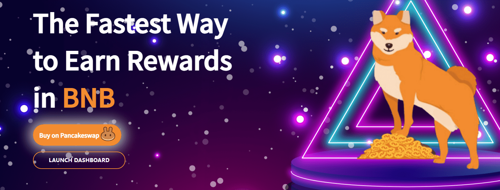

# BNB INU

BNB 犬。是币安智能链上的一种通缩加密货币，以 BNB 形式向代币持有者提供奖励。目前，全球加密货币市场价值 1.5 万亿美元，而 BNB 拥有高达 500 亿美元的市值。

当你的 BNB Inu.代币不断升值，持有也可以获得BNB奖励。

此代币为您提供了通过两种方式赚取的难得机会。

BNB 是加密世界中最受欢迎的交易所之一的原生币，也具有巨大的升值潜力。只需持有 BNB Inu。&nbsp;

代币在你的钱包里，你会在我们网站的仪表板中收到BNB，每72小时可以提取到你的钱包。

但是，这个想法并不是让持有者通过 BNBalone 赚钱。凭借我们强大的渗透战略和无与伦比的营销，我们打算投入 BNB Inu。走在所有营销渠道和所有加密货币平台的最前沿。

这将提升 BNBInu 的价值。代币，而我们的代币持有者继续获得 BNB 奖励。

每次卖出交易后，30分钟内卖出费用将翻倍。并且将随着30分钟冷却时间的减少而减少，以避免倾倒。

增加1%作为营销税，这将有助于营销BNB INU。奖励我们活跃的社区

