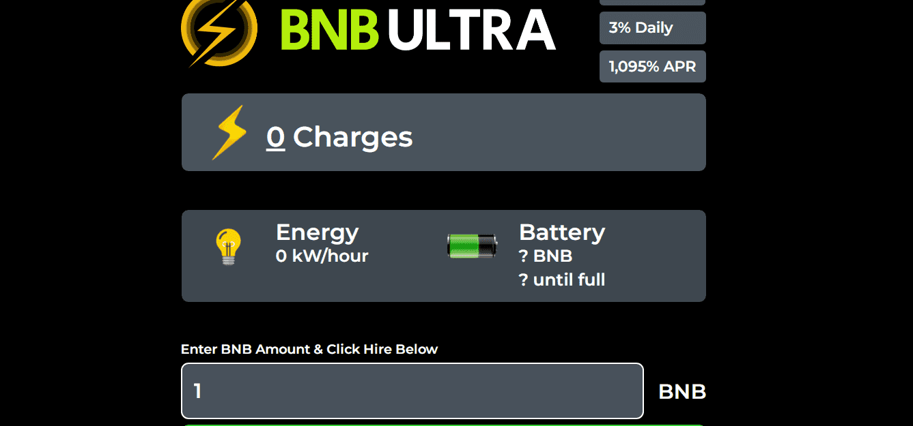

# BNB Ultra

/指导

如何通过 Bnbultra 购买和赚取被动收入？

很简单！使用选定的 BNB 投资购买费用，您将把您的资金转换为 TVL 和一定数量的费用。小心收费是通货膨胀，这意味着价值上升和下降！

请务必阅读应用程序上提供的常见问题解答指南：https://bnbultra.com 并了解策略和风险！ :)

&nbsp;通过投资 bnbultra，我可以期待什么？

Bnbultra 为您提供每天赚取 3% 利润的机会，从长远来看，您可以将其收入囊中或复合以赚取更多利润。这很简单，团队希望您喜欢我们的应用程序和我们的社区！

如何实现利润最大化？

您可以通过两种方式最大化利润：

- 使用您的推荐链接并与您的朋友分享！每当他们投资时，您将获得他们投资的 10%，可直接提取或可复合到您的电池中！:)

- 对冲下跌趋势的化合物！当持有者决定将他们的投资收入囊中时，他们会从矿工的智能合约中获取价值，从而降低每个人的 TVL。只有一种方法：复合！复合时，您会使用电池购买更多费用。当更多的投资者加入冒险时，您将获得更多的长期利润！

如果我的 TVL 出现故障怎么办？

要有耐心！人们会撤退，复合&amp;随着时间的推移再投资。如果您信任该项目并热爱您所属的社区，那么随着时间的推移，复利是确保更多利润的方法！

Bnbultra 开发团队致力于让所有投资者满意。&nbsp;

