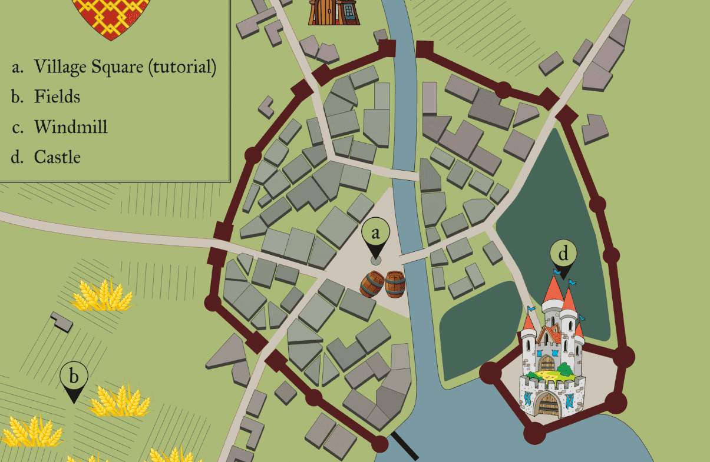

# BNB Windmill

BNB Windmill 是 BNB 智能链上的一款中世纪游戏。 你可以收割小麦，然后在风车中生产 BNB，初始日收益率为 10%。

游戏的原则是通过在适当的时间再投资于小麦（价格会发生变化）来保持您的回报，以便能够收回您的资金并赚取利润（通过在您想要的时候提取)。

**什么是BNB Windmill？**

那就是“收获小麦并获得BNB，初始费率为每天10％”！

我们的核心就是为使用者带来更多的利益，我们欢迎你来体验，因为如果你来体验，那么我敢保证，你一定会被我们折服，并且深深地震惊！

请注意，我们也有一定的原则，游戏的原则是通过在适当的时间再投资于小麦（价格会发生变化）来保持您的回报，以便能够收回您的资金并赚取利润（通过在您想要的时候提取)。
