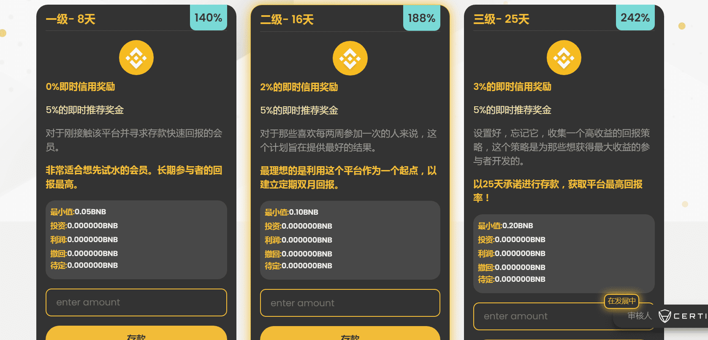
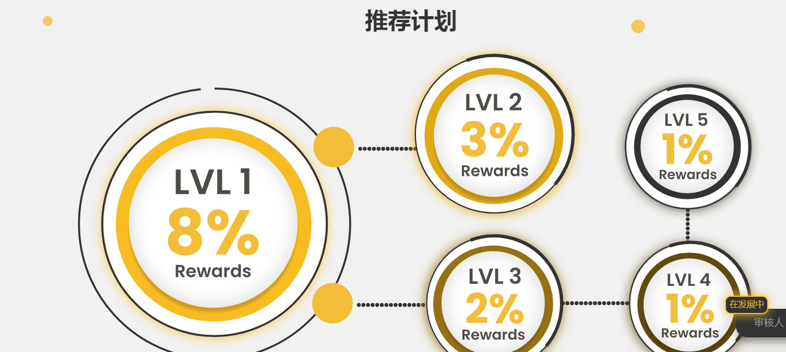

# BNBLevels

通过质押 BNB 赚取被动收入

BNBLevels 是一个社区开发的高收益投资计划。该合约旨在奖励社区，尤其是在加密市场正经历重大市场波动的时候。

BNBLevels 是一个自动获利系统，是 Defi 世界的一个新概念。 BNBLevels是基于币安智能链（BSC）的全新自动质押服务平台，为用户提供固定且一致的每日收益。希望通过质押增加收入的用户会发现该网站是安全的。使用 BSC 网络可确保交易快速完成。因此，用户可以体验轻松流畅的质押体验。

在进行存款时，每日收入固定为 17.5%，即可提款。用户还可以通过加入 BNBLevels 推荐计划来赚钱。

该服务于 2022 年 4 月 7 日刚刚推出，它将利用当前市场状况造成的波动。

BNBLevels 向市场推出了一种新开发的质押策略，以确保获得最大回报并满足基于我们的套餐承诺的最低回报。这是通过定时用户承诺的资金数量和每个区块的每日奖励来实现的。为了确保我们协议的持续增长，我们确保我们始终超过回报，而不是用户选择的相应承诺计划中所述的回报。一定比例的存款将用于确保 BNBLevels 平台的发展。存款人按其投资比例分配给每个用户，并准备在分配的时间提取。

**欢迎来到BNB水平**汽车利润系统

