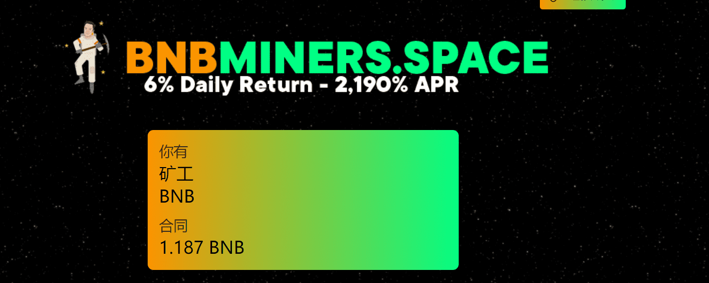

# BNBMiners Space

BNBMiners Space 专为有长远眼光的个人而设计。 不适合那些想要立即获利的人最终会伤害他人。 矿工可以被视为内部代币，其价值根据社区的综合行动而上升和下降，就像您可能持有的任何其他硬币或代币一样。 但是，与您的普通代币和代币不同，BNMBiners Space 允许您通过长期利用其复合功能来稳定和增加您的 TVL。

**TVL是什么？**

TVL是你目前估计的“锁定总价值”，一个你总矿工的估计价值。一旦矿工被雇佣，他们无限期地为你工作，因此你的TVL不能一次付清。当你雇佣矿工时，他们会在你的宇宙飞船里装满BNB，估计每天TVL总量的6%。您可以随时提取或合成您的飞船中积累的BNB。过于频繁的提款会导致TVL的减少，这反过来又会导致你每日支出的减少。矿工的价值在一天中不断增加和减少，因此当你的飞船继续装满时，看到你的个人TVL波动是正常的。

BNBMiners空间面临高风险。请谨慎投资。BNBMiners Space不会对您的投资损失负责。密码市场和区块链技术是高风险的！永远做你自己的尽职调查不要投资超过你能承受的损失！感谢您的支持！

分享你的BNBMiners空间推荐链接，当任何人使用你的链接雇佣矿工时，我们的合同会向你支付10%的推荐费:

请连接您的钱包以查看您的推荐链接。

