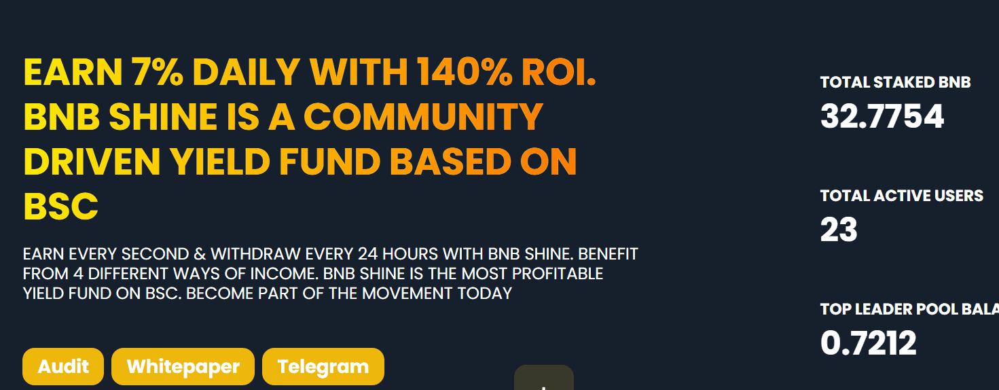

# BNBShine

每日投资回报率 - 7%

最大投资回报率 – 140%

什么是 BNB Shine？

如今，在区块链上启动项目只需单击鼠标按钮。这就是我们每天都看到新项目如雨后春笋般部署的原因。这些项目是否符合投资者的标准和期望，或者它只是获利的只有一方，即开发商或项目所有者？

BNB Shine 不仅仅是一个域名或项目名称。这是一个由 3 位加密爱好者组成的团队，他们一直在投资项目和 Dapps。我们知道当您作为投资者投资您的收益或利润以获得更好的回报时的感受，却只知道项目崩溃或资金不足退出。很痛……很痛。随着我们从私人社区以及我们的团队或调查专家那里收集到的反馈，我们开发了一个项目：

✓ 安全 - 由 HazeCrypto Audits &amp;证券

✓ 透明——全球任何人都可以访问我们的代码

✓ 诚实 – 一个由开发人员、项目所有者和核心团队成员组成的团队，希望项目和投资者双赢

免责声明：这是一个实验性社区项目，这意味着该项目具有高风险和高回报。 一旦合约余额降至零，所有付款将立即停止。 这个项目是去中心化的，因此它属于社区。 存款风险自负。

