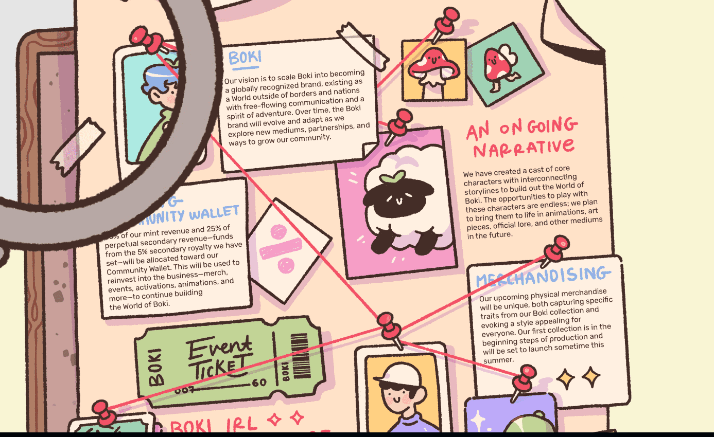

# BokiNFT

欢迎来到我们的世界，在这里，孩子般的想象力自由奔放，幻想被颂扬。

<strong>Boki</strong> 是 Boki 世界中 7,777 个独特角色的集合。 Boki 是一个以社区为中心的项目，以协作和联系为中心。 我们的目标是吸引热衷于在 Web3 中学习和成长的富有想象力的梦想家和冒险家。 每个 Boki 都允许您访问 Boki 的仅限持有者的 Discord 频道、数字和 IRL 活动、独家商品等。

Boki 世界是每个人的家园。

欢迎来到 Boki 的世界。 在我们的世界里，梦想家和冒险家一起探索新大陆，结交新朋友，共同发展社区。 好奇、激情和爱是博基人的歌谣，指南针、地图和冒险鞋是他们的旋律。 连绵起伏的平原到多云的天空； 白雪皑皑的山顶到波光粼粼的河流； 从地平线到地平线的日出和日落。 Boki 的世界是任何人和每个人的家园。

我们邀请您与我们一起探索我们的世界 - 梦想、冒险和逃避现实等待着您！

Boki 是 7,777 个独特的不可替代代币 (NFT) 的集合，它们将驻留在以太坊区块链上。 我们的团队设计了多样化和包容性的特征选择，包括发型、服装、配饰等，以最好地代表我们的世界和我们美好的社区。 每个 Boki 都是在彻底的生成过程中手工制作的，为每个人创造了独特的角色。
