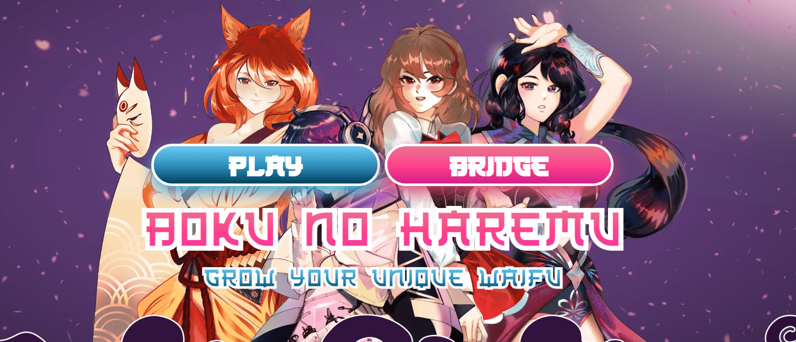
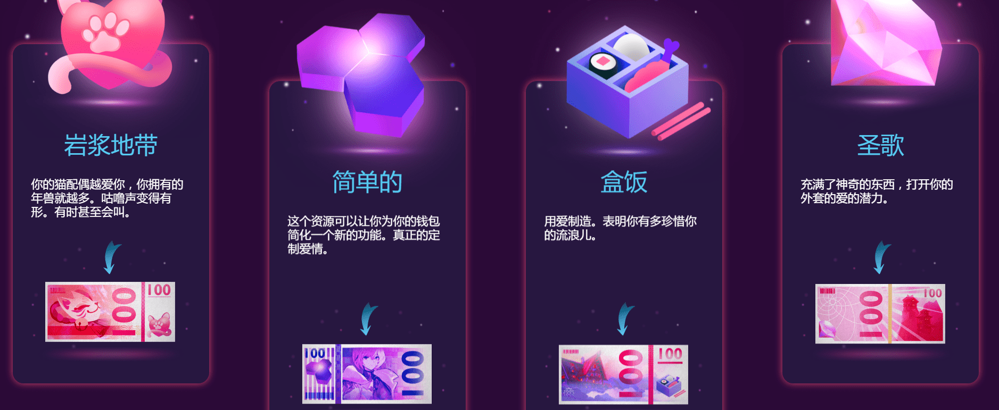

# Boku no Haremu

<strong>Boku no Haremu</strong> - 是一款基于 <strong>NFT</strong> 的游戏，在 <strong>WAX 区块链</strong> 上开发。 每个人都可以选择自己的主要资源和waifu：与您心爱的<strong>Chantresses</strong>一起在<strong>Chantments</strong>中收集魔法，与可爱的<strong>Hitomi一起烹饪<strong>Bento</strong> </strong>，帮助 <strong>H1-Brides </strong>使用 <strong>Simpthetix</strong> 开发新技术来恢复世界或与您爱的 <strong>Mimi-chans </strong>一起奔跑并传播<strong>Nyans</strong>。 需要资源来收集更多的waifus，用于融合以提高他们的水平。 升级可以为您的 waifus 赢得独特的属性，例如视觉特征和技能统计。

带流浪者走向胜利！

你有没有想过我们的世界可能会非常不同？想象一个没有城市，没有政府的文明。

只有等待英雄带领他们走向光明未来的野兔…整个经济都建立在有钱人的基础上，如果对待得当，他们会给你他们所有的东西。

**完全生成的外服**

你的外服每升一级都会获得一个新的特征，这个特征将永远伴随着她

你把你的外服每升一级，看她成长！

**成为一个绅士英雄**

最强有力的领导人拥有最多的追随者，并且知道如何像对待女士一样对待他们。

发展经济不仅要在市场上的演员之间建立关系，还要和你的宝贝朋友们建立关系。

毕竟，爱是这个世界的主要货币…

