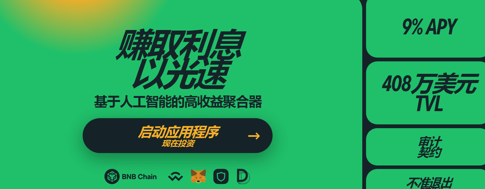

# Bolide

Bolide 是下一代去中心化收益聚合器，可优化跨多个 DeFi 投资平台的数字资产部署，为投资者节省时间、金钱并为他们赚取尽可能高的收益。&nbsp;

在先进的人工智能和智能合约的支持下，Bolide 允许来自世界任何地方的加密货币客户将他们的加密资产投资于自动化投资“Bolide Strategies”（低、中、高），平均产生 20% 的 APY ，完全不用动手指。

---

优势：

BLID 代币价格因硬性上限、预定销毁和市场回购而上涨。

投资稳定币意味着您比其他代币更能免受市场波动的影响。 您可以随时提取您的硬币，让您更加安心。

Bolide 财政部持续管理利润，以确保项目有足够的资金来运营，并将风险降至最低以保护我们的社区。
