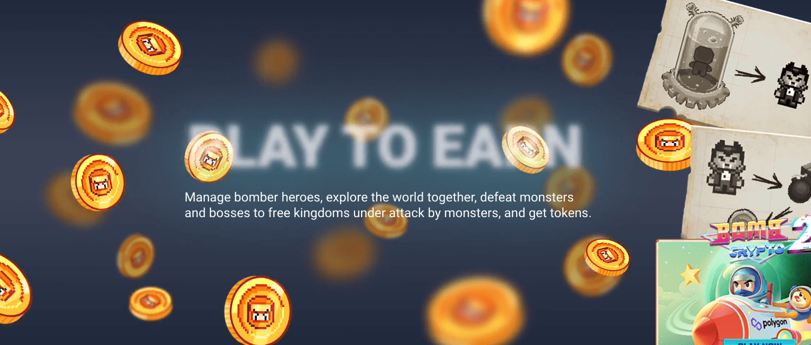

# Bomb Crypto

Bomb Crypto 游戏属于 Play-To-Earn 类型，玩家管理一组机器人炸弹英雄，这些机器人被编程为搜索 BCOIN 并与怪物战斗。

本指南将帮助您了解有关游戏玩法的基础知识以及 通过 Bomb Crypto 网站赚钱。

由越南区块链协会和币安主办的BombCrypto -越南#NFT峰会2022。🔥 08/06/22 🔥关于PVP模式的偷偷峰-2022年6月22日🔥️ 17/06/22 🎙BOMBCRYPTO -演讲者在越南会见2022 BNB CHAIN🎙 08/06/22💎亚马逊模式下的奖励公告💎

BCOIN token是游戏中的主要货币。 将用于购买轰炸机英雄，升级轰炸机等级，主要在第一阶段。 Senspark (SEN)是一个令牌，用于在Senspark及其合作伙伴的生态系统中建立一个平台，以支持应用于GameFi和元宇宙产品的金融和经济系统。

列表和游戏发布: -9月22日在PancakeSwap上市的BCOIN。 -游戏于9月30日发布，第一个版本在网络平台上。 BCOIN智能合同由Verichains实验室审核。
