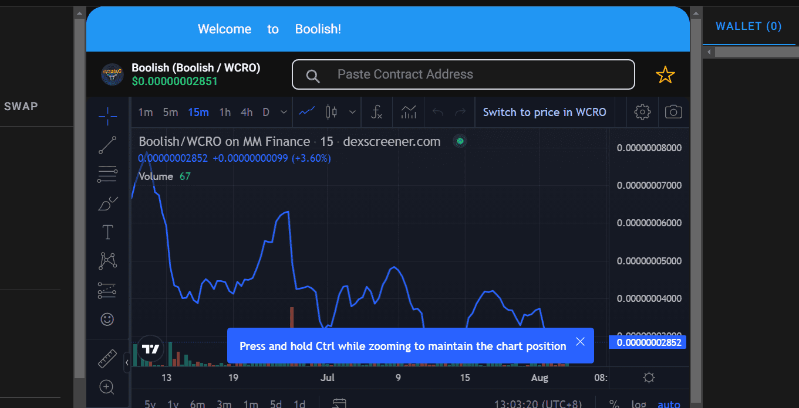

# Boolish

Boolish 是同类产品中首个用于 Cronos 区块链的投资组合跟踪器和图表应用程序，可让您轻松查看钱包中的所有代币及其美元价值。 旨在为习惯于 Poocoin 用户界面的 meme-coin 投资者顺利过渡到 Cronos，并进行了一些改进。 Boolish 是一款适用于桌面和移动设备的设计，是一款渐进式 Web 应用程序，很快将在 Android 和 iOS 上可用。 Boolish 实用程序代币的持有者将获得许多好处，例如内置的地毯检查器、开发钱包跟踪器、新配对、质押等等。

