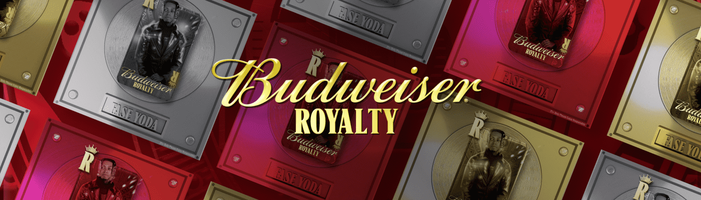

# Budweiser Royalty X Fase Yoda

介绍 Fase Yoda，22 位百威皇室艺术家之一。这位嘻哈/另类音乐家来自路易斯安那州的马克斯维尔，拥有 500 个可用的 NFT，让早期的粉丝可以自豪地代表他们。 

核心 NFT 充当收藏品，让持有者从一开始就描绘出他们是粉丝。稀有和超稀有 NFT 将解锁对 Fase Yoda 的访问级别，并提供与他们建立更密切关系的机会。此项目和奖励仅适用于 21 岁以上（或法定饮酒年龄）的 NFT 收藏家。条款和条件适用。

Fase Yoda X 百威皇室 NFT - 常见问题 (FAQ)
▶ 什么是 Fase Yoda X 百威皇室？
Fase Yoda X Budweiser Royalty 是一个 NFT（不可替代代币）系列。存储在区块链上的数字艺术品集合。
▶ 存在多少 Fase Yoda X Budweiser 版税代币？
总共有 457 个 Fase Yoda X Budweiser 版税 NFT。目前，349 位车主的钱包中至少有一个 Fase Yoda X Budweiser Royalty NTF。
▶ 最近卖出了多少 Fase Yoda X Budweiser Royalty？
过去 30 天内共售出 0 个 Fase Yoda X Budweiser 版税 NFT。

