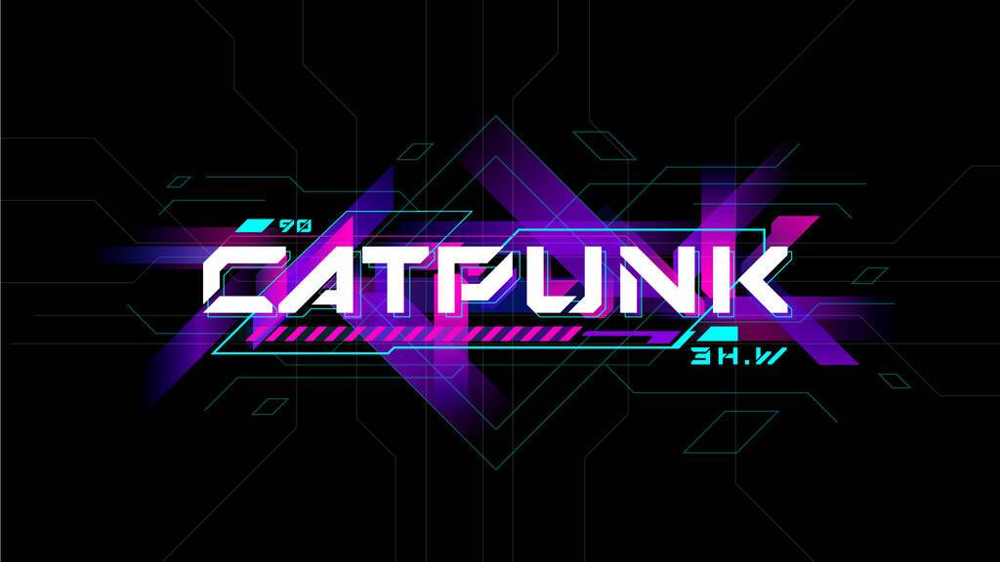

# C.r.y.p.t.o.C.a.t.P.u.n.k

加密猫朋克#2991，销售将于 2022 年 9 月 23 日凌晨 1:40 GMT+8结束 

CryptoCatPunk 是生活在 Polygon 区块链上的 10,000 只手绘 3D 猫

接受所有未上市 NFT 的底价优惠！

CryptoCatPunk NFT - 常见问题（FAQ）
▶ 什么是 CryptoCatPunk？
CryptoCatPunk 是一个 NFT（不可替代令牌）集合。存储在区块链上的数字艺术品集合。
▶ 有多少 CryptoCatPunk 代币？
总共有 9,120 个 CryptoCatPunk NFT。目前 7 位所有者的钱包中至少有一个 CryptoCatPunk NTF。
▶ 最近卖出了多少 CryptoCatPunk？
过去 30 天内售出 0 个 CryptoCatPunk NFT。

