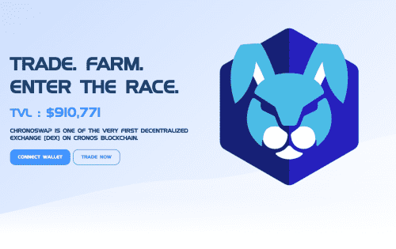
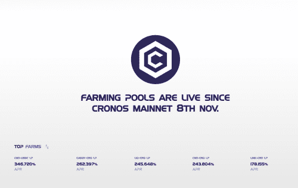

# Chronoswap

Chronoswap 是 Cronos 区块链上第一个专注于提供一流交易体验的去中心化交易所 (DEX)。

为您的资产提供真正的效用。 重新控制您的代币并释放其全部潜力

**通货紧缩机制**

目前

**20%**的交易费用已用于回购 CNO 并销毁。

**发送到开发者钱包的65%**的 CNO 在常规事件中被烧毁（我们计划在未来进行调整，以建立一个 ChronoSwap 财政部以供未来发展）。

Auto CNO Pool 中每次收获的**2%会在常规活动中被烧掉（我们计划在未来对其进行调整，以便为未来的发展建立一个 ChronoSwap 国库）。**

## **一般细节**

**代码：**$CNO

**合约地址：**

**链：**克罗诺斯（CRC-20）

目前 CNO 代币的供应没有硬性上限，使其成为通胀代币。

社区成员经常指出这是一个令人担忧的原因，虽然创始赛车手当然理解硬顶的愿望，但我们不希望在不久的将来设置一个很大的原因：

**CNO 的主要功能是激励向交易所提供流动性。如果没有整体奖励，提供流动性的动力就会大大减少。在控制 $CNO 供应部分了解更多信息。**

