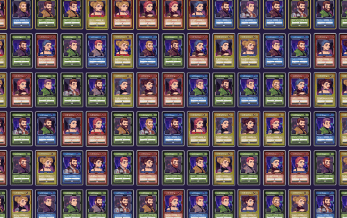
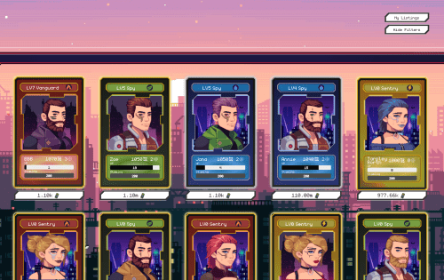

# CipherShooters

领导者将组成一个小队，准备与利用 CipherCity 的邪恶公司霸主作战。随着时间的推移，玩家可以获得代币和武器，让他们能够加强他们的小队并将城市从压迫者手中夺回。

Ciphershooters 是第一款通过良性循环支持真正可持续经济的 Play to Earn 游戏。核心为所有玩家创造奖励，并随着玩家参与经济而增长。这创造了循环，核心创造奖励，玩家加入以获得奖励，玩家活动为核心提供动力，核心创造更多奖励，进而吸引更多玩家！

Core 让 Ciphershooters 摆脱了传统的“即玩即赚”游戏机制，该机制通过各种汇和税收努力将用户留在他们的生态系统中，以免耗尽他们的经济奖励系统或给他们的经济造成巨大的通货膨胀。< /p>

虽然核心存在于 CipherCity 中，但我们看到了它也可以为元宇宙提供动力的未来。

CipherCity 是 Ciphershooters 所在的 NFT 领域。这片土地将是一个 100x100 的网格，充满了不战而退的敌人。运营商必须联手从敌人手中清除土地，然后才能占领这片土地。一旦认领，经营者可以用商店、工作台和其他有益元素来补充他们的土地。

拥有一个 Operator 是一种独特的体验，这就是为什么 Operator 将拥有 10,000 种独特的外观，每个单独的类都有其自己的 10,000 种排列。

CipherShooters 是一款 Play and Earn 游戏，它利用区块链技术的关键组件授予玩家实际的数字所有权、跨元界代币的互操作性以及无需信任的协议。

该游戏位于三个新兴市场的交叉点：加密货币、NFT（不可替代代币）和游戏。CipherShooters 的经济使用双重代币系统和最先进的经济模型，不需要新用户向现有用户付费，从而实现真正可持续的经济
