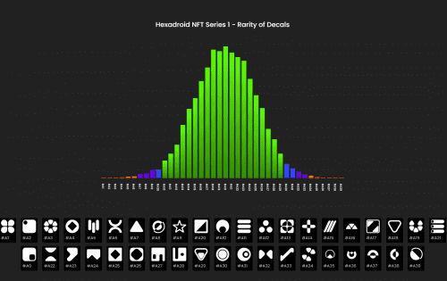

# Citadel Of The Machines

一个不同于其他物理沙盒 IDE 的游戏世界

<strong>一款 3D 冒险解谜游戏。 可玩的 NFT 角色。 一个值得探索的世界。</strong>

<strong>永恒的过去。</strong> 雷击使飞船的计算机终于苏醒。 唯一能发挥作用的机械装置是一个低级的服务机器人。 六边形。

计算机发出命令：前往地球并进行探索，以发现可以让飞船返回家园的电源。

复古未来在您的浏览器中。 Citadel NFT 是 CITADEL 3D 虚拟世界中的可玩角色。 选择一个机器人，使用工具，探索世界并与其他 CITADEL 居民分享冒险。

构建和分享您自己的地图。 一个支持 3D 物理的沙盒，在您的浏览器中具有集成开发环境。 添加生物、障碍物、谜题、奇怪的科幻机器、配乐和视觉效果。

**工具和游戏**

实时IDE

在游戏运行时构建您自己的地图。添加声音、生物、陷阱、谜题、平台等。

沙盒编辑器对所有玩家免费。

**可玩的 NFT**

Citadel NFT 与游戏世界交互。如果它在您的钱包中，则可以在游戏中使用。

系列 1 Hexadroid NFT 可在发布时购买。

