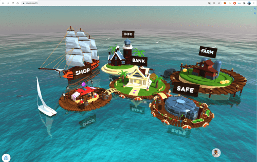
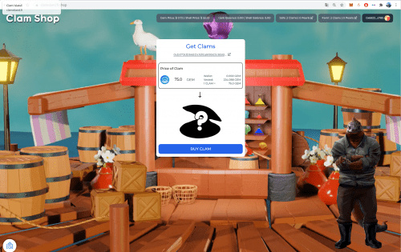

# Clam Island

<strong>什么是 Clam Island？</strong>

Clam Island 将区块链投资游戏化在 3D 岛上，游戏中的角色支持用户完成整个 NFT 和 DeFi 投资流程让 DeFi 变得简单、有趣和有效。该平台引入了 Play-to-Invest 模型作为 DeFi 的游戏化标准。 Clam Island 生态系统将 Yieldfarming 与完全互动的游戏内 3D NFT 相结合。 Clam Island 团队参加了 Tachyon 的 Filecoin Launchpad Accelerator Programs 并被公开 doxxed。

<strong>Play-to-Invest 是什么意思？</strong>

在Play-to-Invest-Platform 你玩游戏来投资区块链项目。与需要投入时间和技能才能赚钱的 Play-to-Earn 模式不同，在 Clam Island 这样的 Play-to-Invest-Platform 上，您可以通过玩游戏来投资您的资金并赚取回报，而无需投资时间或技能来从您的投资中赚钱。

<strong>它是如何运作的？</strong>

想象你在一个岛上收集蛤蜊和珍珠。你的蛤蜊可以生产珍珠。你建立一个农场，在其中放入蛤蜊并赚取珍珠。以一种简单的方式——这就是蛤蜊岛的运作方式。它有两个代币（$SHELL 和 $GEM）和两个 NFT（蛤蜊和珍珠）生态系统。

