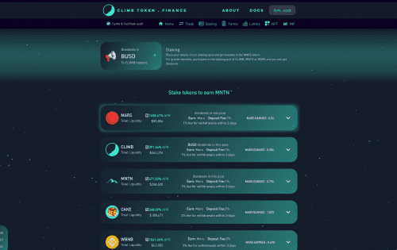
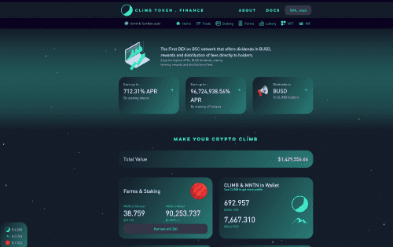

# Climb Token Finance V2

BSC 上第一个直接向持有者提供 BUSD 股息、奖励和费用分配的 DEX。 &nbsp;享受最高的 APR（农业和质押）#BSC

更新&nbsp;<strong>通货紧缩</strong>DeFi 协议，目的是奖励用户更多的红利和新的财务结构 价格上涨。 <strong>只要持有。</strong> <strong>首个交易所交易代币基金 (ETTF) 和通缩协议。</strong>

# **💰通过 CLIMB 获得利润的方法**

- **持有 CLIMB：**我们财务策略的利润将反映在 CLIMB 的价格中。
- **将它们保存在钱包中：** CLIMB 持有者无需锁定资金即可获得利润。只要保持 CLIMB，他们就可以赚取 BUSD 的利润和每两周一次的红利。
- **每两周将 BUSD 分红到持有人的钱包。（被动收入）**
- **质押：**如果持有者想要更多的利润，他们可以将他们的 CLIMB 代币进行质押，以在替代代币 MNTN 中产生利润。
- **农业：**如果持有者想要更多的利润，他们可以将他们的 CLIMB 代币放在农业中，以在替代代币 MNTN 中产生利润。
- **当我们回购代币时：**通过减少交易所流动性池中的代币，价格将立即上涨。我们将从我们的财务策略中获得的利润和我们 DApp 产生的费用进行回购。
- **当我们销毁代币时：**通过减少流通中的代币，价格将立即上涨。
- **当我们调整流动资金池时。**

