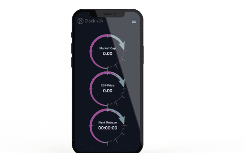

# Clock 24

Cx24 正在通过其自动质押协议彻底改变去中心化金融：一种创新的新金融协议将简化和改变基本质押，这要归功于放大的自动质押收益率，它提供了指数级的固定 APY。 自动质押协议 CAP，授予 $C24 原生代币，一种精致的自动质押和拨号功能。 此外，这些功能的引入加强了代币的价值主张，每 10 分钟生成一个固定的 APY。

## Cx24.io 概述

自动质押 - Rebase - 永久奖励

**CX24.io 提供去中心化金融资产，每 10 分钟奖励用户 0.018% 的资产增长。C24 奖励生成是一种具有先进盈利能力的独特协议。C24 奖励协议每 10 分钟为所有活跃用户生成并分配 0.018% 的奖励。该协议配备 RFI 属性。该协议配备了其他分叉所缺乏的创新技术和功能。它专为自动化和高效而设计。**

**CX24.io rebase tokennomics**  为了支持其价格和 rebase 奖励，CX24.io 采用了一组复杂的因素。它包括 $C24 时钟保险基金 (CIF)，它充当保险基金，通过保持每 10 分钟支付给所有 $C24 代币持有者的 0.018% 的一致基准利率来确保 C24 协议的价格稳定性和长期可行性。

**质押 - 简单安全**  C24 代币始终留在您的钱包中；它不需要放入高风险质押合约中。您需要做的就是购买并持有它，并在您自己的钱包中自动增加奖励，因此无需了解质押/解除质押机制，也无需为质押操作支付额外的税费。

**CX24.io 保险基金**  $C24 保险基金，缩写为 CIF，是 C24 CAP 系统中的一个独立钱包。CIF 采用支持 Rebase 奖励的算法，资金来自 CIF 钱包中累积的部分买卖交易费用。简而言之，CIF 参数支持每 10 分钟以 0.018% 的利率分配的质押奖励（rebase 奖励），确保 C24 美元代币持有者获得高且稳定的利率。

**降低与下行相关的风险**  通过保持恒定的增长水平确保长期增长的连续性 通过重新调整基础策略确保价格稳定

**C24 国库**  国库在 C24 CAP 协议中非常重要。它为 CX24.io 的增长和长期生存能力执行三个关键功能。国库是 CIF 的额外资金来源。如果 $C24 代币的价格大幅下跌，这种额外的支持可能会很有用。它有助于建立 $C24 代币的底价。
