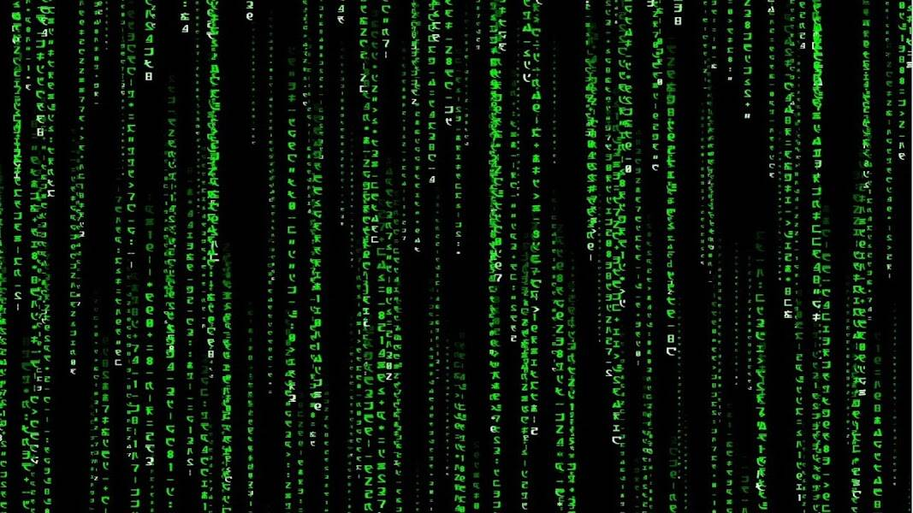

# Code Cracker

密码破解者

这是过去 7 天内的数据， Code Cracker没有出售记录。

333 次机会 - 六个线索，一个 Discord 服务器，多个赢家。

Code Cracker NFT - 常见问题（FAQ）
▶ 什么是密码破解者NFT？
Code Cracker 是一个 NFT（Non-fungible token）集合。存储在区块链上的数字艺术品集合。
▶ 总共存在多少 Code Cracker 代币？
总共有 298 个 Code Cracker NFT。目前 113 位所有者的钱包中至少有一个 Code Cracker NTF。
▶ 最近卖出了多少个 Code Cracker？
过去 30 天内，并没有销售记录，售出 0 个 Code Cracker NFT。

