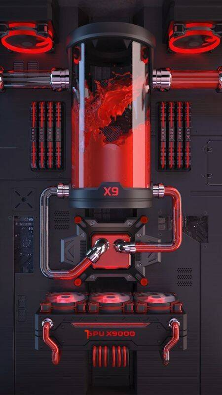

# CODE X9

Code X9 是楚华创建的 3,333 个生成 NFT 字符的集合。薄荷后一天揭晓。Reveal 网站将对持有者开放，您需要烧掉您的血清来展示您的新角色。坚持你的血清。

CODE X9 NFT - 常见问题（FAQ）
▶ 什么是 CODE X9？
CODE X9 是一个 NFT（不可替代代币）集合。存储在区块链上的数字艺术品集合。
▶ CODE X9 代币有多少？
总共有 3,333 个 CODE X9 NFT。目前，1,548 位所有者的钱包中至少有一个 CODE X9 NTF。
▶ 最近卖出了多少CODE X9？
过去 30 天内售出 0 个 CODE X9 NFT。
▶ 流行的 CODE X9 替代品有哪些？
许多拥有 CODE X9 NFT 的用户还拥有 Official Tiny Owls、 AI Metaverse、 Sada NFT和 HatBeardMan。

