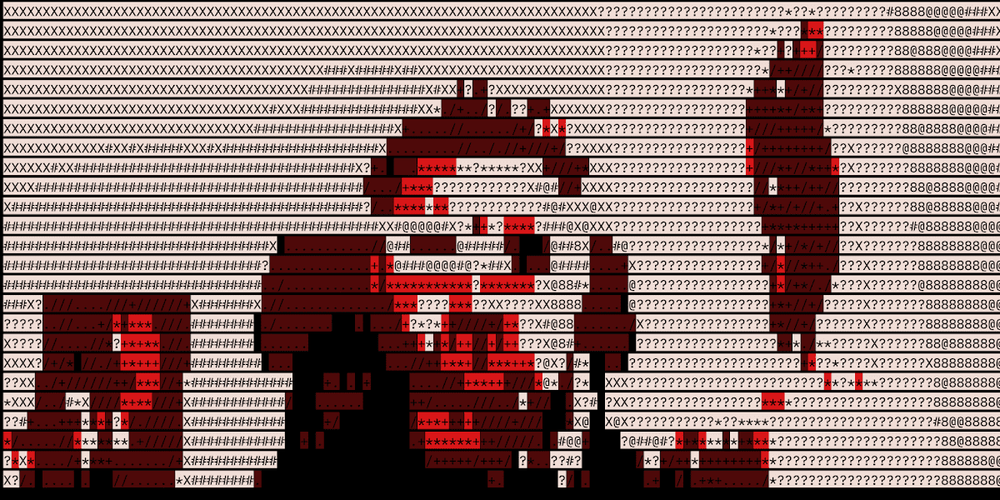

# Coded Selfies

编码自拍统计

过去 7 天内未售出任何编码自拍。

编码自拍，由Mattia Cuttini和Skygolpe进行的一项社会实验。

未公开的自拍照让您可以直接从网站 alltherest.io 制作自己的自拍照

所有其余的集合。

编码自拍 NFT - 常见问题（FAQ）
▶ 什么是编码自拍？
Coded Selfies 是一个 NFT（不可替代令牌）集合。存储在区块链上的数字艺术品集合。
▶ 有多少个 Coded Selfies 代币？
总共有 1,000 个编码自拍 NFT。目前，737 位所有者的钱包中至少有一个 Coded Selfies NTF。
▶ 最昂贵的 Coded Selfies 促销是什么？
出售的最昂贵的 Coded Selfies NFT 是 UNREVEALED SELFIE。它于 2022-06-08（3 个月前）以 79.8 美元的价格售出。
▶ 最近卖出了多少编码自拍？
过去 30 天内售出了 1 个 Coded Selfies NFT。
▶ 有哪些流行的编码自拍替代品？
许多拥有 Coded Selfies NFT 的用户还拥有 Aterium Universe Genesis、 Pixcasso 的艺术品、 Omni Robottos和 st0ked。

