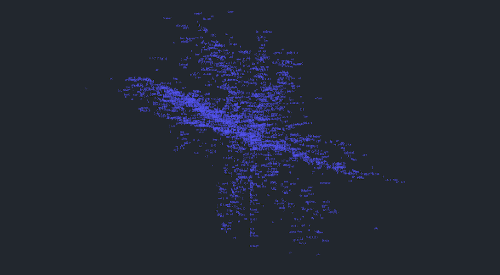

# Code Fractals

356 个分形代码片段由公共领域的不朽**软件片段组成，每个片段都以****独特的艺术**方式使我们现代骨干中经常被低估的方面永垂不朽。代码几乎为我们接触的一切和任何事物提供动力。

Code Fractal Genesis NFT - 常见问题（FAQ）
▶ 什么是代码分形起源？
Code Fractal Genesis 是一个 NFT（Non-fungible token）集合。存储在区块链上的数字艺术品集合。
▶ 存在多少 Code Fractal Genesis 代币？
总共有 356 个 Code Fractal Genesis NFT。目前，133 位所有者的钱包中至少有一个 Code Fractal Genesis NTF。
▶ 最近卖出了多少 Code Fractal Genesis？
过去 30 天内共售出 0 个 Code Fractal Genesis NFT。

