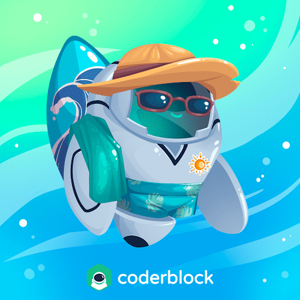

# Coderblock - Special Edition

Coderblock - 特别版 NFT 在过去 7 天内售出 1 次。Coderblock - 特别版的总销量为 $109.78。一个 Coderblock - 特别版 NFT 的平均价格为 109.8 美元。有 6 个 Coderblock - 特别版所有者，总共拥有 10 个代币。

Coderblock 是一个基于 Polygon 区块链的虚拟世界，您可以在其中与您的头像一起享受令人惊叹的游戏体验并增加您的商机。这些数字艺术品收藏品以限量版收藏品的形式出现，它们中的每一个都为您提供 Coderblock Metaverse 内的独家冒险和奖励。

